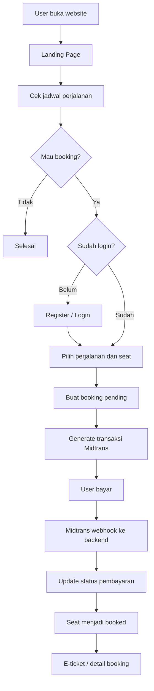

# Website Flow - Landing Page, Admin Dashboard, API, Auth, Supabase, Midtrans

## 1. Tujuan Website
Website berfungsi sebagai:
- landing page untuk user melihat layanan dan jadwal perjalanan
- portal booking berbasis web
- pusat admin untuk mengelola rute, armada, perjalanan, seat, dan transaksi
- backend API layer yang dipakai bersama oleh website dan aplikasi Flutter

Website harus terintegrasi dengan:
- **Supabase** untuk database, auth, dan role management
- **Midtrans** untuk pembayaran
- **Flutter app** melalui API yang sama

---

## 2. Role dan Hak Akses

### Admin
Login menggunakan Supabase Auth dan hanya bisa masuk ke dashboard admin.
Hak akses admin:
- tambah, edit, hapus rute
- tambah, edit, hapus armada
- tambah, edit, hapus jadwal/perjalanan
- melihat detail seat kosong / ter-booking per perjalanan
- melihat daftar booking
- memverifikasi status pembayaran dari Midtrans webhook
- melihat data user dan riwayat transaksi

### User
User publik bisa:
- buka landing page
- cek jadwal tanpa login
- lihat detail perjalanan, armada, harga, dan seat availability ringkas

User terdaftar bisa:
- login / register
- booking kursi
- bayar via Midtrans
- lihat status booking
- lihat riwayat transaksi

---

## 3. Flow Besar Sistem Website

---

## 4. Struktur Halaman Website

## 4.1 Landing Page
Tujuan landing page adalah menarik user dan memudahkan pencarian jadwal secepat mungkin.

### Section utama
1. **Hero section**
   - headline utama
   - CTA: Cek Jadwal
   - form pencarian cepat: asal, tujuan, tanggal, jumlah penumpang

2. **Keunggulan layanan**
   - armada nyaman
   - jadwal teratur
   - pembayaran aman
   - customer support

3. **Cara booking**
   - cek jadwal
   - pilih perjalanan
   - pilih kursi
   - bayar
   - dapat tiket

4. **List rute populer**
   - menampilkan rute populer
   - CTA ke halaman jadwal

5. **Promo / banner informasi**
   - opsional bila ada diskon atau event

6. **Footer**
   - kontak
   - alamat
   - sosial media
   - syarat & ketentuan

### CTA utama landing page
- Cek Jadwal
- Pesan Sekarang
- Login / Daftar

---

## 4.2 Halaman Cek Jadwal
User bisa mengakses halaman ini **tanpa login**.

### Input pencarian
- kota asal
- kota tujuan
- tanggal keberangkatan
- jumlah kursi

### Output hasil pencarian
- jam berangkat
- jam tiba
- nama rute
- armada yang dipakai
- kelas armada
- harga
- sisa kursi
- tombol detail / booking

### Rules
- jika user hanya ingin cek jadwal, tidak perlu login
- jika user klik booking, sistem cek apakah sudah login sebagai user
- bila belum login, redirect ke halaman register/login

---

## 4.3 Halaman Detail Perjalanan
Menampilkan:
- informasi rute
- armada
- harga
- fasilitas armada
- layout seat
- seat available / booked / locked

### Status seat
- **available**: bisa dipilih
- **locked**: sedang ditahan sementara oleh user lain sebelum pembayaran selesai
- **booked**: sudah dibayar / confirmed

---

## 4.4 Halaman Booking
Setelah login user:
1. pilih seat
2. isi data penumpang bila diperlukan
3. review booking
4. klik lanjut pembayaran
5. sistem membuat booking status `pending_payment`
6. sistem generate transaksi Midtrans

---

## 4.5 Halaman Status Booking
User dapat melihat:
- kode booking
- detail perjalanan
- seat yang dipilih
- status pembayaran
- status booking
- tombol bayar lagi bila transaksi belum berhasil
- tombol download tiket jika sudah sukses

---

## 4.6 Dashboard Admin
Dashboard admin dipisah dari halaman user/public.

### Menu dashboard
1. Dashboard ringkasan
2. Manajemen rute
3. Manajemen armada
4. Manajemen perjalanan
5. Manajemen seat / occupancy
6. Booking & transaksi
7. Data user
8. Laporan
9. Logout

---

## 5. Flow Dashboard Admin

## 5.1 Tambah Rute
Admin mengisi:
- kode rute
- kota asal
- kota tujuan
- titik keberangkatan
- titik kedatangan
- estimasi durasi
- jarak bila diperlukan
- status aktif/nonaktif

### Flow
1. Admin login
2. Buka menu **Rute**
3. Klik **Tambah Rute**
4. Isi form
5. Simpan ke database
6. Rute muncul untuk dipakai saat membuat perjalanan

---

## 5.2 Tambah Armada
Admin mengisi:
- kode armada
- nama armada / unit
- nomor polisi
- tipe armada
- kelas layanan
- kapasitas seat
- layout seat
- fasilitas
- status aktif/nonaktif

### Catatan penting
Layout seat sebaiknya disimpan sebagai template, misalnya:
- 2-2 standard bus
- 2-1 executive
- sleeper layout

### Flow
1. Admin buka menu **Armada**
2. Klik **Tambah Armada**
3. Isi data armada
4. Pilih template layout seat
5. Simpan
6. Sistem generate master seat berdasarkan template

---

## 5.3 Tambah Perjalanan
Perjalanan adalah jadwal nyata yang memakai kombinasi rute + armada.

Admin mengisi:
- pilih rute
- pilih armada
- tanggal berangkat
- jam berangkat
- jam tiba estimasi
- harga
- status perjalanan

### Flow
1. Admin buka menu **Perjalanan**
2. Klik **Tambah Perjalanan**
3. Pilih **rute** dari data rute
4. Pilih **armada** dari data armada
5. Input tanggal/jam dan harga
6. Simpan
7. Sistem clone daftar seat armada ke tabel seat_per_trip
8. Jadwal langsung bisa tampil di website/app

---

## 5.4 Detail Seat Kosong / Ter-booking
Admin dapat membuka detail perjalanan tertentu.

### Tampilan yang dibutuhkan
- info perjalanan
- total seat
- jumlah seat available
- jumlah seat locked
- jumlah seat booked
- visual seat map
- daftar booking per seat

### Logic seat
- seat diambil dari `seat_per_trip`
- setiap seat punya status realtime
- admin dapat melihat siapa pemesan seat tertentu bila perlu

---

## 6. Arsitektur API
Disarankan menggunakan satu backend/API service yang dipakai oleh:
- website public
- website admin
- Flutter app

### Pilihan implementasi
- **Supabase + Edge Functions** untuk endpoint inti
- atau **Next.js / NestJS / Express** sebagai backend terpisah

Rekomendasi paling praktis:
- **Frontend Website:** Next.js / Nuxt / React
- **DB & Auth:** Supabase
- **Payment:** Midtrans
- **Realtime / status seat:** Supabase Realtime

---

## 7. Endpoint API yang Disarankan

## 7.1 Auth
- `POST /auth/register`
- `POST /auth/login`
- `POST /auth/logout`
- `GET /auth/me`

## 7.2 Public / User
- `GET /routes`
- `GET /armadas`
- `GET /trips/search?origin=&destination=&date=`
- `GET /trips/:id`
- `GET /trips/:id/seats`
- `POST /bookings`
- `GET /bookings/:id`
- `GET /my-bookings`
- `POST /payments/create`
- `POST /payments/midtrans/webhook`

## 7.3 Admin
- `POST /admin/routes`
- `PUT /admin/routes/:id`
- `DELETE /admin/routes/:id`
- `POST /admin/armadas`
- `PUT /admin/armadas/:id`
- `DELETE /admin/armadas/:id`
- `POST /admin/trips`
- `PUT /admin/trips/:id`
- `DELETE /admin/trips/:id`
- `GET /admin/trips/:id/seats`
- `GET /admin/bookings`
- `GET /admin/users`
- `GET /admin/dashboard-summary`

---

## 8. Struktur Database Supabase

## 8.1 Tabel `profiles`
Menyimpan data user tambahan.

Field:
- `id` (uuid, relasi ke auth.users)
- `email`
- `name`
- `address`
- `phone`
- `role` (`admin` / `user`)
- `created_at`

## 8.2 Tabel `routes`
Field:
- `id`
- `route_code`
- `origin_city`
- `destination_city`
- `origin_point`
- `destination_point`
- `duration_minutes`
- `is_active`
- `created_at`

## 8.3 Tabel `armadas`
Field:
- `id`
- `armada_code`
- `name`
- `plate_number`
- `class_type`
- `seat_capacity`
- `seat_layout_template`
- `facilities` (jsonb)
- `is_active`
- `created_at`

## 8.4 Tabel `armada_seat_templates`
Field:
- `id`
- `armada_id`
- `seat_number`
- `seat_row`
- `seat_col`
- `deck`
- `seat_type`

## 8.5 Tabel `trips`
Field:
- `id`
- `route_id`
- `armada_id`
- `departure_datetime`
- `arrival_datetime`
- `price`
- `status` (`scheduled`, `completed`, `cancelled`)
- `created_at`

## 8.6 Tabel `trip_seats`
Seat per perjalanan.

Field:
- `id`
- `trip_id`
- `seat_number`
- `seat_row`
- `seat_col`
- `status` (`available`, `locked`, `booked`)
- `locked_until`
- `booking_id` nullable

## 8.7 Tabel `bookings`
Field:
- `id`
- `booking_code`
- `user_id`
- `trip_id`
- `total_amount`
- `booking_status` (`pending_payment`, `paid`, `cancelled`, `expired`)
- `payment_status` (`pending`, `settlement`, `expire`, `cancel`, `deny`)
- `midtrans_order_id`
- `created_at`

## 8.8 Tabel `booking_seats`
Field:
- `id`
- `booking_id`
- `trip_seat_id`
- `price`

## 8.9 Tabel `payments`
Field:
- `id`
- `booking_id`
- `provider` (`midtrans`)
- `transaction_id`
- `order_id`
- `gross_amount`
- `transaction_status`
- `fraud_status`
- `payment_type`
- `raw_response` (jsonb)
- `created_at`
- `updated_at`

---

## 9. Auth dan Role Separation di Supabase

## 9.1 Register User
Saat user daftar:
- email
- password
- nama
- alamat
- no hp

### Flow register
1. User isi form daftar
2. Supabase Auth membuat account
3. Trigger / function membuat record di `profiles`
4. Default role = `user`

## 9.2 Admin
Admin **tidak** daftar dari halaman publik.
Admin dibuat manual oleh super admin / database seed.

### Cara aman
- admin dibuat di Supabase Auth
- lalu `profiles.role = 'admin'`
- dashboard admin hanya bisa diakses jika role admin

## 9.3 Row Level Security (RLS)
Gunakan RLS untuk memisahkan akses.

### Rule minimum
- user hanya bisa membaca dan update profilnya sendiri
- user hanya bisa melihat booking miliknya sendiri
- admin bisa mengakses semua data operasional
- tabel sensitif seperti payments dan trips write access hanya untuk admin/backend

---

## 10. Flow Booking dan Seat Lock

### Kenapa perlu seat lock
Agar satu seat tidak dibooking 2 user sekaligus.

### Flow
1. User pilih trip
2. User pilih seat
3. Sistem ubah seat menjadi `locked`
4. `locked_until` diset misalnya +10 menit
5. Sistem buat booking `pending_payment`
6. User diarahkan ke Midtrans
7. Jika pembayaran sukses sebelum lock habis:
   - booking jadi `paid`
   - seat jadi `booked`
8. Jika pembayaran gagal / timeout:
   - booking jadi `expired` atau `cancelled`
   - seat kembali `available`

### Background process
Perlu job / cron untuk release seat yang lock-nya kadaluarsa.

---

## 11. Flow Pembayaran Midtrans

### Alur pembayaran
1. User klik bayar
2. Backend generate `order_id`
3. Backend kirim request ke Midtrans Snap / Core API
4. Midtrans mengembalikan token / redirect URL
5. User menyelesaikan pembayaran
6. Midtrans mengirim webhook ke backend
7. Backend verifikasi signature
8. Backend update `payments`, `bookings`, dan `trip_seats`

### Mapping status Midtrans
- `pending` -> booking tetap `pending_payment`
- `settlement` / `capture` -> booking `paid`, seat `booked`
- `expire` -> booking `expired`, seat `available`
- `cancel` / `deny` -> booking `cancelled`, seat `available`

### Endpoint penting
- `POST /payments/create`
- `POST /payments/midtrans/webhook`

---

## 12. Dashboard Summary yang Disarankan
Pada halaman utama admin tampilkan:
- total user
- total booking hari ini
- total transaksi sukses hari ini
- total perjalanan aktif
- occupancy hari ini
- daftar booking terbaru
- daftar pembayaran pending

---

## 13. UX Flow Website yang Disarankan

## Public flow
1. User buka website
2. User lihat landing page
3. User cek jadwal
4. User lihat detail perjalanan
5. User diminta login jika ingin booking
6. User booking seat
7. User bayar
8. User dapat tiket / status booking

## Admin flow
1. Admin login
2. Admin kelola rute
3. Admin kelola armada
4. Admin buat perjalanan
5. Admin monitor seat occupancy
6. Admin monitor pembayaran dan booking

---

## 14. Rekomendasi Teknis Implementasi

### Frontend website
- Next.js
- Tailwind CSS
- Supabase JS Client
- Midtrans Snap integration

### Backend / service layer
- Supabase Edge Functions atau Next.js API routes
- webhook Midtrans di endpoint server-side
- cron/worker untuk release seat lock expired

### Database
- Supabase Postgres
- RLS aktif
- function / trigger untuk auto create profile dan clone seat template saat trip dibuat

---

## 15. Prioritas Pengerjaan Website

### Phase 1 - Fondasi
- setup Supabase
- setup auth
- setup role admin/user
- buat schema database

### Phase 2 - Admin dashboard
- CRUD rute
- CRUD armada
- CRUD perjalanan
- detail seat per perjalanan

### Phase 3 - Public booking
- landing page
- pencarian jadwal
- detail perjalanan
- booking + seat lock

### Phase 4 - Payment
- integrasi Midtrans
- webhook callback
- update booking status

### Phase 5 - Penyempurnaan
- tiket / invoice
- laporan admin
- notifikasi email / WhatsApp
- analytics occupancy

---

## 16. Catatan Penting Arsitektur
- gunakan **1 source of truth** untuk seat, yaitu tabel `trip_seats`
- jangan membaca seat langsung dari armada saat transaksi berjalan
- semua booking harus melalui backend agar seat locking aman
- Midtrans webhook wajib jadi penentu final status pembayaran
- role admin dan user harus dipisah jelas lewat `profiles.role` + RLS
- user boleh cek jadwal tanpa login, tapi wajib login untuk booking

---

## 17. Hasil Akhir yang Diharapkan
Website final memiliki 3 area utama:
1. **Landing/Public Website** untuk promosi dan cek jadwal
2. **User Booking Area** untuk login, pilih seat, bayar, lihat tiket
3. **Admin Dashboard** untuk mengelola rute, armada, perjalanan, seat, booking, dan pembayaran

Dengan struktur ini, website siap menjadi pusat operasional dan juga sumber API untuk aplikasi Flutter.
